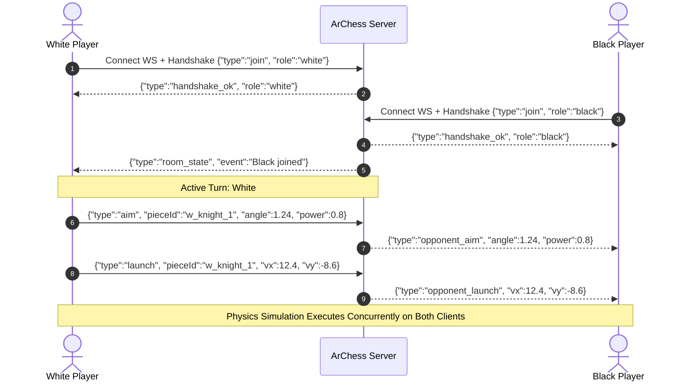

# 🏛️ ArChess System Architecture & Technical Blueprint

This document details the architectural topology, component responsibilities, real-time data flows, concurrency models, database schemas, and physics kinematics governing the **ArChess** platform.

---

## 📋 Table of Contents
1. [System Topology](#-system-topology)
2. [Component Responsibilities](#-component-responsibilities)
3. [Real-Time Game Synchronization & WebSockets](#-real-time-game-synchronization--websockets)
4. [Kinetic Arena Physics Kinematics](#-kinetic-arena-physics-kinematics)
5. [3D WebGL Studio Rendering Pipeline](#-3d-webgl-studio-rendering-pipeline)
6. [Database Schema & Concurrency](#-database-schema--concurrency)
7. [Security Architecture & Defensive Controls](#-security-architecture--defensive-controls)
8. [Structured Logging & Telemetry Engine](#-structured-logging--telemetry-engine)

---

## 🏗️ System Topology

```
┌─────────────────────────────────────────────────────────────────────────────┐
│                             CLIENT BROWSER                                  │
│                                                                             │
│  ┌─────────────────────────┐           ┌─────────────────────────────────┐  │
│  │   2D Kinetic Arena      │           │     3D WebGL Studio Engine      │  │
│  │ (HTML5 Canvas + Vectors)│           │ (Three.js PBR + ACES Tone Map)  │  │
│  └────────────┬────────────┘           └────────────────┬────────────────┘  │
│               │                                         │                   │
│               └───────────────────┬─────────────────────┘                   │
│                                   │                                         │
│                     REST (JSON)   │   WebSocket Stream (/ws)                │
└───────────────────────────────────┼─────────────────────────────────────────┘
                                    │
                                    ▼
┌─────────────────────────────────────────────────────────────────────────────┐
│                          INGRESS / REVERSE PROXY                            │
│  Nginx / Cloudflare (TLS 1.3, HTTP/2, WebSocket Upgrade, Asset Caching)     │
└───────────────────────────────────┬─────────────────────────────────────────┘
                                    │
                                    ▼
┌─────────────────────────────────────────────────────────────────────────────┐
│                     APPLICATION TIER (WSGI / Python 3.11+)                  │
│                                                                             │
│  ┌───────────────────────────────────────────────────────────────────────┐  │
│  │ Gunicorn / Waitress Multi-Threaded WSGI Worker Pool                   │  │
│  └───────────────────────────────────┬───────────────────────────────────┘  │
│                                      │                                      │
│  ┌───────────────────────────────────┴───────────────────────────────────┐  │
│  │ backend/app.py (Flask Core Application)                               │  │
│  │  ├── REST Endpoints (Auth, Profile, Match Settlement, Leaderboard)    │  │
│  │  ├── WebSocket Streamer (/ws/combat/<room_id>)                        │  │
│  │  ├── Defense-in-Depth Middleware (Security Headers, Rate Limiters)    │  │
│  │  └── Health & Monitoring Probe (/api/health)                          │  │
│  └───────────────────┬───────────────────────────────────┬───────────────┘  │
│                      │                                   │                  │
│                      ▼                                   ▼                  │
│  ┌──────────────────────────────────────┐ ┌──────────────────────────────┐  │
│  │ backend/multiplayer.py               │ │ backend/tournament.py        │  │
│  │ (Combat Rooms & Matchmaking Queue)   │ │ (Knockout Championship Eng)  │  │
│  └───────────────────┬──────────────────┘ └──────────────┬───────────────┘  │
│                      │                                   │                  │
│                      └─────────────────┬─────────────────┘                  │
│                                        │                                    │
│                                        ▼                                    │
│  ┌───────────────────────────────────────────────────────────────────────┐  │
│  │ backend/achievements.py (Master Catalog & Evaluator)                  │  │
│  └───────────────────────────────────┬───────────────────────────────────┘  │
│                                      │                                      │
└──────────────────────────────────────┼──────────────────────────────────────┘
                                       │
                                       ▼
┌─────────────────────────────────────────────────────────────────────────────┐
│                      PERSISTENCE & LOGGING TIER                             │
│                                                                             │
│  ┌───────────────────────────────────┐ ┌──────────────────────────────────┐  │
│  │ backend/database.py (SQLite WAL)  │ │ backend/logger.py                │  │
│  │  ├── Thread-Safe Connection Pool  │ │  ├── JSON Structured Formatter   │  │
│  │  ├── 30s Busy Timeout + WAL Mode  │ │  └── Run Rotation & Reclaim      │  │
│  │  └── backend/backup.py (Online API│ └──────────────────────────────────┘  │
│  └───────────────────────────────────┘                                      │
└─────────────────────────────────────────────────────────────────────────────┘
```

---

## 📁 Component Responsibilities

| Subsystem | Key Files | Responsibility |
| :--- | :--- | :--- |
| **Server Engine** | [`run.py`](file:///c:/Users/mohda/Python%20Codes/ARCHESS/run.py), [`backend/app.py`](file:///c:/Users/mohda/Python%20Codes/ARCHESS/backend/app.py) | Application entrypoint, WSGI environment selection, REST routing, WebSocket protocol handling, rate-limiting, and security headers. |
| **Data & Storage** | [`backend/database.py`](file:///c:/Users/mohda/Python%20Codes/ARCHESS/backend/database.py), [`backend/backup.py`](file:///c:/Users/mohda/Python%20Codes/ARCHESS/backend/backup.py) | Thread-safe SQLite persistence, ELO calculations, user authentication, profile mutation, and zero-downtime online backup automation. |
| **Multiplayer Engine** | [`backend/multiplayer.py`](file:///c:/Users/mohda/Python%20Codes/ARCHESS/backend/multiplayer.py) | In-memory battle room state, role assignment (`white`, `black`, `spectator`), live aim broadcast, and matchmaking ticket queues. |
| **Tournament Engine** | [`backend/tournament.py`](file:///c:/Users/mohda/Python%20Codes/ARCHESS/backend/tournament.py) | Knockout championship bracket simulation, seasonal seeding, match simulation, and history persistence with thread locks. |
| **Achievements** | [`backend/achievements.py`](file:///c:/Users/mohda/Python%20Codes/ARCHESS/backend/achievements.py) | 8 platform achievement criteria, match evaluation heuristics, and unlock ledger. |
| **Notation & Telemetry**| [`backend/notation.py`](file:///c:/Users/mohda/Python%20Codes/ARCHESS/backend/notation.py), [`backend/logger.py`](file:///c:/Users/mohda/Python%20Codes/ARCHESS/backend/logger.py) | Dynamic PGN/FEN generation, JSON structured logging with correlation IDs, and run lifecycle management. |
| **2D Kinetic Arena** | [`static/js/game.js`](file:///c:/Users/mohda/Python%20Codes/ARCHESS/static/js/game.js) | Slingshot trajectory arcs, elastic collisions, perimeter cushion rebounds, Citadel King mass, and Web Audio synthesis. |
| **3D WebGL Studio** | [`static/js/engine3d.js`](file:///c:/Users/mohda/Python%20Codes/ARCHESS/static/js/engine3d.js) | Three.js Staunton procedural geometries, PBR alabaster/obsidian materials, studio lighting, dynamic board themes, and orbit controls. |

---

## ⚡ Real-Time Game Synchronization & WebSockets

ArChess supports real-time multiplayer with sub-50ms latency using WebSocket streams (`/ws/combat/<room_id>`):



---

## 🧮 Kinetic Arena Physics Kinematics

### 1. Elastic Impulse & Collision Resolution
When two pieces $A$ and $B$ collide:
$$\vec{v}_{rel} = \vec{v}_A - \vec{v}_B$$
$$J = \frac{-(1 + e)(\vec{v}_{rel} \cdot \vec{n})}{\frac{1}{m_A} + \frac{1}{m_B}}$$
Where:
* $e = 0.82$ (Coefficient of restitution).
* $m = 1.0$ for pawns/bishops/knights, $1.4$ for rooks, $1.8$ for queen, and $4.0$ for the King Citadel.
* $\vec{n}$ is the normalized contact normal between circle centers.

### 2. Perimeter Cushion Walls
Four elastic boundaries cushion the 8x8 battlefield:
$$v_x' = -v_x \times e_{wall}, \quad v_y' = -v_y \times e_{wall} \quad (e_{wall} = 0.78)$$
Each wall contact spawns particle sparks and sound impulses.

---

## 🪐 3D WebGL Studio Rendering Pipeline

* **Renderer**: WebGL2 with shadow maps enabled (`PCFSoftShadowMap`) and ACES Filmic tone mapping (`exposure: 1.0`).
* **Studio Photometric Lighting System**:
  * Key Directional Light: `1.05` intensity, warm light (`0xfff7ed`) casting soft shadows.
  * Ambient Light: `0.42` intensity (`0xfff8ed`) providing gentle hemispherical fill.
  * Secondary Fill Light: `0.40` intensity (`0xdbeafe`) softening shadow depth.
  * Rim Light: `0.55` intensity (`0x93c5fd`) highlighting Staunton silhouettes from the rear.
  * Warm Front Fill: `0.30` intensity (`0xfef3c7`) for frontal specular definition.
  * Center Spotlight: `0.55` intensity (`0xfffbeb`) focused on active tiles.
* **PBR Shading**:
  * White Army: Satin alabaster (`0xe8e2d5`, `roughness: 0.30`, `clearcoat: 0.25`).
  * Black Army: Satin obsidian (`0x222a36`, `roughness: 0.32`).
  * Board Tiles: Beveled procedural boxes with alternating maple/birch cream (`0xdcd0bb`) and rich walnut (`0x483526`).

---

## 🗄️ Database Schema & Concurrency

Persistent data is managed via SQLite in **Write-Ahead Logging (WAL)** mode.

### Concurrency Guarantees
```python
def get_connection(custom_path=None):
    conn = sqlite3.connect(target_path, timeout=30.0, check_same_thread=False)
    conn.row_factory = sqlite3.Row
    conn.execute("PRAGMA journal_mode=WAL;")
    conn.execute("PRAGMA foreign_keys = ON;")
    conn.execute("PRAGMA busy_timeout = 30000;")
    return conn
```
* `journal_mode=WAL`: Readers do not block writers, and writers do not block readers.
* `busy_timeout=30000`: Queries wait up to 30 seconds if a write transaction is in progress before failing.

---

## 🛡️ Security Architecture & Defensive Controls

1. **SQL Injection Prevention**: 100% parameterization with SQLite tuples (`?`).
2. **Brute-Force Rate Limiting**: In-memory sliding-window limiter on `/api/auth/login` (15 attempts/minute/IP) and match settlement (60 attempts/minute/IP).
3. **Session Cookie Isolation**: `HttpOnly`, `SameSite=Lax`, and conditional `Secure` flag.
4. **WebSocket Memory Guard**: Rejection of all frames exceeding 64KB.
5. **Defense-in-Depth HTTP Headers**:
   * `X-Content-Type-Options: nosniff`
   * `X-Frame-Options: SAMEORIGIN`
   * `Referrer-Policy: strict-origin-when-cross-origin`
   * `Strict-Transport-Security: max-age=31536000; includeSubDomains`

---

## 📝 Structured Logging & Telemetry Engine

Logs are emitted in structured JSON format with unique `X-Request-ID` and correlation IDs:
```json
{
  "timestamp": "2026-09-18T10:45:12.381Z",
  "req_id": "9f825c31-482a-4632-a271-9218d8924b12",
  "method": "POST",
  "path": "/api/matches/record",
  "status": 200,
  "latency_ms": 3.42
}
```
* **Run Lifecycle**: Logs are partitioned into `Logs/YYYY/MMM/DD_Logs/RunXX/`.
* **Automatic Reclamation**: Maintains the 20 most recent run directories and reclaims disk space on startup.
