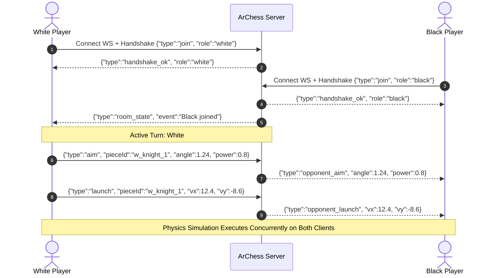

# 🏛️ ArChess System Architecture & Technical Blueprint

This document details the architectural topology, component responsibilities, real-time data flows, concurrency models, database schemas, and physics kinematics governing the **ArChess** platform.

---

## 📋 Table of Contents
1. [System Topology](#-system-topology)
2. [Component Responsibilities](#-component-responsibilities)
3. [Real-Time Game Synchronization & WebSockets](#-real-time-game-synchronization--websockets)
4. [Kinetic Arena Physics Kinematics](#-kinetic-arena-physics-kinematics)
5. [3D WebGL Studio Rendering Pipeline](#-3d-webgl-studio-rendering-pipeline)
6. [Database Schema & Concurrency](#-database-schema--concurrency)
7. [Security Architecture & Defensive Controls](#-security-architecture--defensive-controls)
8. [Structured Logging & Telemetry Engine](#-structured-logging--telemetry-engine)

---

## 🏗️ System Topology

```
┌─────────────────────────────────────────────────────────────────────────────┐
│                             CLIENT BROWSER                                  │
│                                                                             │
│  ┌─────────────────────────┐           ┌─────────────────────────────────┐  │
│  │   2D Kinetic Arena      │           │     3D WebGL Studio Engine      │  │
│  │ (HTML5 Canvas + Vectors)│           │ (Three.js PBR + ACES Tone Map)  │  │
│  └────────────┬────────────┘           └────────────────┬────────────────┘  │
│               │                                         │                   │
│               └───────────────────┬─────────────────────┘                   │
│                                   │                                         │
│                     REST (JSON)   │   WebSocket Stream (/ws)                │
└───────────────────────────────────┼─────────────────────────────────────────┘
                                    │
                                    ▼
┌─────────────────────────────────────────────────────────────────────────────┐
│                          INGRESS / REVERSE PROXY                            │
│  Nginx / Cloudflare (TLS 1.3, HTTP/2, WebSocket Upgrade, Asset Caching)     │
└───────────────────────────────────┬─────────────────────────────────────────┘
                                    │
                                    ▼
┌─────────────────────────────────────────────────────────────────────────────┐
│                     APPLICATION TIER (WSGI / Python 3.11+)                  │
│                                                                             │
│  ┌───────────────────────────────────────────────────────────────────────┐  │
│  │ Gunicorn / Waitress Multi-Threaded WSGI Worker Pool                   │  │
│  └───────────────────────────────────┬───────────────────────────────────┘  │
│                                      │                                      │
│  ┌───────────────────────────────────┴───────────────────────────────────┐  │
│  │ backend/app.py (Flask Core Application)                               │  │
│  │  ├── REST Endpoints (Auth, Profile, Match Settlement, Leaderboard)    │  │
│  │  ├── WebSocket Streamer (/ws/combat/<room_id>)                        │  │
│  │  ├── Defense-in-Depth Middleware (Security Headers, Rate Limiters)    │  │
│  │  └── Health & Monitoring Probe (/api/health)                          │  │
│  └───────────────────┬───────────────────────────────────┬───────────────┘  │
│                      │                                   │                  │
│                      ▼                                   ▼                  │
│  ┌──────────────────────────────────────┐ ┌──────────────────────────────┐  │
│  │ backend/multiplayer.py               │ │ backend/tournament.py        │  │
│  │ (Combat Rooms & Matchmaking Queue)   │ │ (Knockout Championship Eng)  │  │
│  └───────────────────┬──────────────────┘ └──────────────┬───────────────┘  │
│                      │                                   │                  │
│                      └─────────────────┬─────────────────┘                  │
│                                        │                                    │
│                                        ▼                                    │
│  ┌───────────────────────────────────────────────────────────────────────┐  │
│  │ backend/achievements.py (Master Catalog & Evaluator)                  │  │
│  └───────────────────────────────────┬───────────────────────────────────┘  │
│                                      │                                      │
└──────────────────────────────────────┼──────────────────────────────────────┘
                                       │
                                       ▼
┌─────────────────────────────────────────────────────────────────────────────┐
│                      PERSISTENCE & LOGGING TIER                             │
│                                                                             │
│  ┌───────────────────────────────────┐ ┌──────────────────────────────────┐  │
│  │ backend/database.py (SQLite WAL)  │ │ backend/logger.py                │  │
│  │  ├── Thread-Safe Connection Pool  │ │  ├── JSON Structured Formatter   │  │
│  │  ├── 30s Busy Timeout + WAL Mode  │ │  └── Run Rotation & Reclaim      │  │
│  │  └── backend/backup.py (Online API│ └──────────────────────────────────┘  │
│  └───────────────────────────────────┘                                      │
└─────────────────────────────────────────────────────────────────────────────┘
```

---

## 📁 Component Responsibilities

| Subsystem | Key Files | Responsibility |
| :--- | :--- | :--- |
| **Server Engine** | [`run.py`](file:///c:/Users/mohda/Python%20Codes/ARCHESS/run.py), [`backend/app.py`](file:///c:/Users/mohda/Python%20Codes/ARCHESS/backend/app.py) | Application entrypoint, WSGI environment selection, REST routing, WebSocket protocol handling, rate-limiting, and security headers. |
| **Data & Storage** | [`backend/database.py`](file:///c:/Users/mohda/Python%20Codes/ARCHESS/backend/database.py), [`backend/backup.py`](file:///c:/Users/mohda/Python%20Codes/ARCHESS/backend/backup.py) | Thread-safe SQLite persistence, PostgreSQL DDL compatibility, ELO calculations, user authentication, profile mutation, and zero-downtime online backup automation. |
| **Schema Validation** | [`backend/schemas.py`](file:///c:/Users/mohda/Python%20Codes/ARCHESS/backend/schemas.py) | Data contracts, input validation schemas, type validation, and OpenAPI 3.1.0 schema specification mapping. |
| **Multiplayer Engine** | [`backend/multiplayer.py`](file:///c:/Users/mohda/Python%20Codes/ARCHESS/backend/multiplayer.py) | In-memory battle room state, role assignment (`white`, `black`, `spectator`), live aim broadcast, and matchmaking ticket queues. |
| **Tournament Engine** | [`backend/tournament.py`](file:///c:/Users/mohda/Python%20Codes/ARCHESS/backend/tournament.py) | Knockout championship bracket simulation, seasonal seeding, match simulation, and history persistence with thread locks. |
| **Achievements** | [`backend/achievements.py`](file:///c:/Users/mohda/Python%20Codes/ARCHESS/backend/achievements.py) | 8 platform achievement criteria, match evaluation heuristics, and unlock ledger. |
| **Tactical AI & RAG** | [`backend/ai_engine.py`](file:///c:/Users/mohda/Python%20Codes/ARCHESS/backend/ai_engine.py) | 5-Level Adaptive AI, AI vs AI Watch Mode, ReAct Coach agent, pure-Python semantic RAG Codex, and shoutcasting. |
| **Metrics & Telemetry**| [`backend/metrics.py`](file:///c:/Users/mohda/Python%20Codes/ARCHESS/backend/metrics.py), [`backend/logger.py`](file:///c:/Users/mohda/Python%20Codes/ARCHESS/backend/logger.py) | Prometheus exposition format (`/metrics`), bounded latency histograms, JSON structured logging with run rotation. |
| **Notation & Telemetry**| [`backend/notation.py`](file:///c:/Users/mohda/Python%20Codes/ARCHESS/backend/notation.py) | Dynamic PGN/FEN generation, standard coordinate notation mapping, and move history persistence. |
| **2D Kinetic Arena** | [`static/js/game.js`](file:///c:/Users/mohda/Python%20Codes/ARCHESS/static/js/game.js) | Slingshot trajectory arcs, elastic collisions, perimeter cushion rebounds, Citadel King mass, and Web Audio synthesis. |
| **3D WebGL Studio** | [`static/js/engine3d.js`](file:///c:/Users/mohda/Python%20Codes/ARCHESS/static/js/engine3d.js) | Three.js Staunton procedural geometries, PBR alabaster/obsidian materials, studio lighting, dynamic board themes, and orbit controls. |
| **2D Classic FIDE Mode** | [`frontend/src/Archess2DChess.jsx`](file:///c:/Users/mohda/Python%20Codes/ARCHESS/frontend/src/Archess2DChess.jsx), [`static/js/react-chessboard-bundle.js`](file:///c:/Users/mohda/Python%20Codes/ARCHESS/static/js/react-chessboard-bundle.js) | Official FIDE chess rules, legal move validation, FEN synchronizer, and custom responsive vector SVG piece renderers. |
| **Grandmaster Atelier Customizer** | [`static/js/main.js`](file:///c:/Users/mohda/Python%20Codes/ARCHESS/static/js/main.js), [`templates/play.html`](file:///c:/Users/mohda/Python%20Codes/ARCHESS/templates/play.html) | Real-time live board palette & piece style morphing without match resets, in-place navigation link interception, and `sessionStorage` match state persistence. |

---

## ⚡ Real-Time Game Synchronization & WebSockets

ArChess supports real-time multiplayer with sub-50ms latency using WebSocket streams (`/ws/combat/<room_id>`):



---

## 🧮 Kinetic Arena Physics Kinematics

### 1. Elastic Impulse & Collision Resolution
When two pieces $A$ and $B$ collide:
$$\vec{v}_{rel} = \vec{v}_A - \vec{v}_B$$
$$J = \frac{-(1 + e)(\vec{v}_{rel} \cdot \vec{n})}{\frac{1}{m_A} + \frac{1}{m_B}}$$
Where:
* $e = 0.82$ (Coefficient of restitution).
* $m = 1.0$ for pawns/bishops/knights, $1.4$ for rooks, $1.8$ for queen, and $4.0$ for the King Citadel.
* $\vec{n}$ is the normalized contact normal between circle centers.

### 2. Perimeter Cushion Walls
Four elastic boundaries cushion the 8x8 battlefield:
$$v_x' = -v_x \times e_{wall}, \quad v_y' = -v_y \times e_{wall} \quad (e_{wall} = 0.78)$$
Each wall contact spawns particle sparks and sound impulses.

### 3. Tactical Indestructible Fortified Walls
Players can deploy up to 2 indestructible walls per match in exchange for 1 turn move (via double-click or UI deploy button):
* **One-Way Asymmetric Blocking**: Enemy pieces bounce off with normal reflection rebound ($e = 0.72$) and metallic impact sparks; friendly allied pieces pass freely through without rebound or velocity loss.
* Rigid AABB box perimeter collision pushes non-leaping enemy pieces outside the boundary tile.
* Permanent structural durability ($\infty\text{ HP}$, indestructible).
* **Knight Vaulting**: Leaping Knights in parabolic flight bypass wall collisions completely.

### 4. Explosive Landmines & Immediate AoE Blast Kinematics
Players can deploy up to 2 landmines per match in exchange for 1 turn move (via triple-click or UI deploy button):
* **Immediate Blast-Off**: Detonates instantaneously upon placement, triggering screen shake (15px), shockwaves, and fireball particle VFX.
* **AoE Blast Radius**: $R_{blast} = 1.35 \times \text{sqSize}$.
* **Distance-Scaled Damage**:
  $$\text{DMG} = \max\left(15, \left\lfloor 42 \times \max\left(0.35, 1 - 0.45 \frac{d}{R_{blast}}\right) \right\rfloor\right)$$
* **Radial Knockback Impulse**:
  $$\vec{v}_{impulse} = \max\left(1.5, \left(1 - \frac{d}{R_{blast}}\right) \times 8.5\right) \times \hat{u}_{radial}$$
* **Non-Lethal Blast Protection**: Blast damage reduces piece HP but caps at $\max(1, \text{HP} - \text{DMG})$. Non-pawn pieces survive with at least 1 HP.
* **Absolute Sovereign Immunity**: The Sovereign King and King Fortress Citadel Wall are 100% immune (0 damage).
* **Permanent Hazard Marker**: After detonation, the landmine casing remains anchored on the board as a tactical ground hazard plate.

### 5. Veteran Pawn Ascension & Citadel Defense
* **Veteran Ascension**: Pawns must eliminate at least one non-pawn officer (`killedNonPawn == true`) AND reach the deep back cushion of the opponent's first rank outside the King's fortress wall to promote to Queen.
* **Fortified King Citadel**: Kings are anchored behind a square fortress bulkhead absorbing damage and inflicting 25% recoil back onto ramming attackers.

### 6. Strict 1-Move-Only Turn Lock State Machine
To guarantee deterministic turn-based physics without race conditions or multi-move exploits:
* **Atomic Move Lock**: Upon piece launch or tactical deploy, `turnHasMoved = true;` and `simulationSettling = true;` are set synchronously.
* **Input Isolation**: All pointerdown, pointermove, pointerup, click, and keyboard triggers reject interaction if `turnHasMoved || simulationSettling || anyMoving`.
* **Slingshot Drag Separation**: Pointer drag distances $< 24\text{px}$ cancel piece dragging and route cleanly to square click detection (`onSquareClick`), preventing mouse jitter from triggering launches.
* **Settlement & Transition**: Only when all pieces physically settle ($\|\vec{v}\| \le 0.15$ and `!anyInMotion`), `turnHasMoved` resets to `false`, `turns++` increments, and turn transfers to the opponent.

## 🪐 3D WebGL Studio Rendering Pipeline

* **Renderer**: WebGL2 with shadow maps enabled (`PCFSoftShadowMap`) and ACES Filmic tone mapping (`exposure: 1.0`).
* **Studio Photometric Lighting System**:
  * Key Directional Light: `1.05` intensity, warm light (`0xfff7ed`) casting soft shadows.
  * Ambient Light: `0.42` intensity (`0xfff8ed`) providing gentle hemispherical fill.
  * Secondary Fill Light: `0.40` intensity (`0xdbeafe`) softening shadow depth.
  * Rim Light: `0.55` intensity (`0x93c5fd`) highlighting Staunton silhouettes from the rear.
  * Warm Front Fill: `0.30` intensity (`0xfef3c7`) for frontal specular definition.
  * Center Spotlight: `0.55` intensity (`0xfffbeb`) focused on active tiles.
* **PBR Shading**:
  * White Army: Satin alabaster (`0xe8e2d5`, `roughness: 0.30`, `clearcoat: 0.25`).
  * Black Army: Satin obsidian (`0x222a36`, `roughness: 0.32`).
  * Board Tiles: Beveled procedural boxes with alternating maple/birch cream (`0xdcd0bb`) and rich walnut (`0x483526`).

---

## 🗄️ Database Schema & Concurrency

Persistent data is managed via SQLite in **Write-Ahead Logging (WAL)** mode.

### Concurrency Guarantees
```python
def get_connection(custom_path=None):
    conn = sqlite3.connect(target_path, timeout=30.0, check_same_thread=False)
    conn.row_factory = sqlite3.Row
    conn.execute("PRAGMA journal_mode=WAL;")
    conn.execute("PRAGMA foreign_keys = ON;")
    conn.execute("PRAGMA busy_timeout = 30000;")
    return conn
```
* `journal_mode=WAL`: Readers do not block writers, and writers do not block readers.
* `busy_timeout=30000`: Queries wait up to 30 seconds if a write transaction is in progress before failing.
* `BEGIN IMMEDIATE Write Transactions`: Write operations in `record_match_result` acquire a SQLite `RESERVED` lock immediately upon start, preventing concurrent read-to-write lock escalation deadlocks across multi-threaded WSGI workers.

---

## 🛡️ Security Architecture & Defensive Controls

1. **SQL Injection Prevention**: 100% parameterization with SQLite tuples (`?`).
2. **Brute-Force Rate Limiting & Bounding**: In-memory sliding-window limiter on `/api/auth/login` (15 attempts/minute/IP) and match settlement (60 attempts/minute/IP) with TTL purging and a 5,000-entry capacity ceiling.
3. **Session Cookie Isolation**: `HttpOnly`, `SameSite=Lax`, and conditional `Secure` flag.
4. **WebSocket Memory Guard & Role Verification**: Rejection of all frames exceeding 64KB, with strict participant role and active turn verification on game actions (`aim`, `launch`, `turn_complete`, `game_over`).
5. **Metric Cardinality Protection**: Prometheus endpoint tracking capped at 250 distinct keys; unexpected paths collapse to `"not_found"` or `"other"`.
6. **Defense-in-Depth HTTP Headers**:
   * `X-Content-Type-Options: nosniff`
   * `X-Frame-Options: SAMEORIGIN`
   * `Referrer-Policy: strict-origin-when-cross-origin`
   * `Strict-Transport-Security: max-age=31536000; includeSubDomains`

---

## 📝 Structured Logging & Telemetry Engine

Logs are emitted in structured JSON format with unique `X-Request-ID` and correlation IDs:
```json
{
  "timestamp": "2026-09-18T10:45:12.381Z",
  "req_id": "9f825c31-482a-4632-a271-9218d8924b12",
  "method": "POST",
  "path": "/api/matches/record",
  "status": 200,
  "latency_ms": 3.42
}
```
* **Run Lifecycle**: Logs are partitioned into `Logs/YYYY/MMM/DD_Logs/RunXX/`.
* **Automatic Reclamation**: Maintains the 20 most recent run directories and reclaims disk space on startup.
